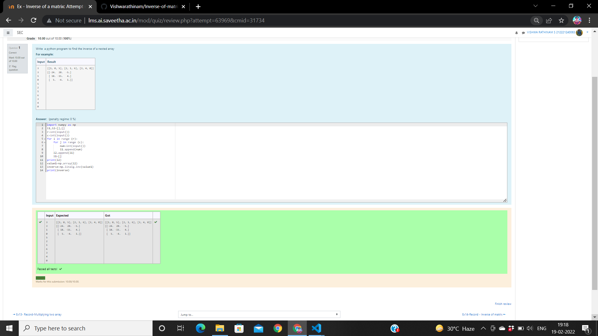

# Inverse-of-matrix

## AIM:
To write a python programm to find the inverse of nested array using numpy module.

## ALGORITHM:

### Step 1:
Import numpy module.

### Step 2:
Declare a variables l1 and l2 as an empty list.

### step 3:
Get the input of the variables n and m.

### Step 4:
Loop a variable i in the range of n and nest loop a variable j in range m

### Step 5:
get the value of num variable

### Step 6:
During the loop append the num values to l1 and l1 valuse to list l2

### Step 7:
During the loop append the num values to l1 and l1 valuse to list l2

### Step 8:
Print the value of the inverse

## PROGRAM:
import numpy as np
z, y= [],[]
a, b= int(input()),int(input())
for i in range(a):
    for j in range(b):
        num=int(input())
        z.append(num)
    y.append(z)
    z=[]
print(y)
var1= np.array(y)
inv = np.linalg.inv(var1)
print(inv)

## OUTPUT:

## RESULT:
Therefore the program is successfully executed to find the inverse of nested arrays using numpy module.
